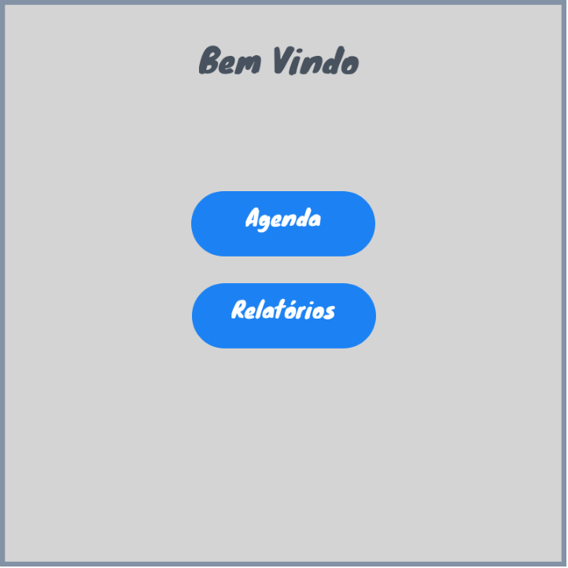
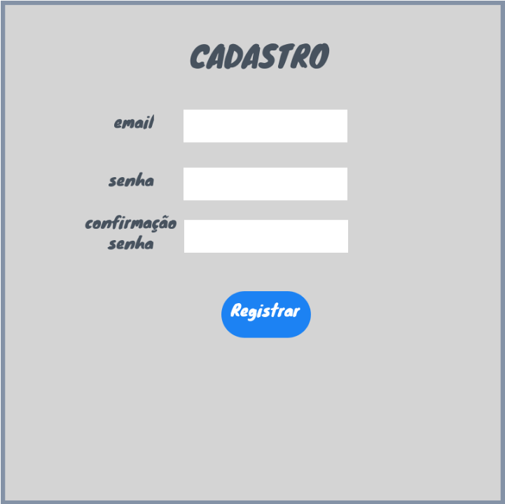
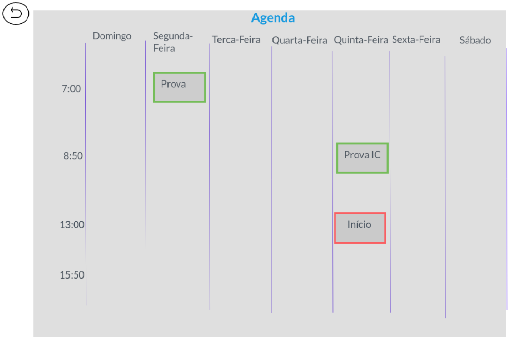
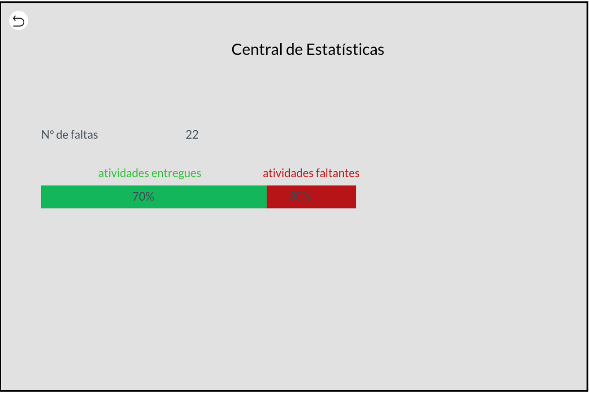

# Informações do Projeto

`TÍTULO DO PROJETO`

...... Rotim ......

`CURSO`

...... Engenharia de Software ......

## Participantes

Os membros do grupo são:

- Luiz Henrique Ferraz de Azevedo
- Bernardo Campos Barbosa
- Alberto da Costa Reis Júnior
- Enzo Barcelos RIos Ferreira

# Estrutura do Documento

- [Informações do Projeto](#informações-do-projeto)
  - [Participantes](#participantes)
- [Estrutura do Documento](#estrutura-do-documento)
- [Introdução](#introdução)
  - [Problema](#problema)
  - [Objetivos](#objetivos)
  - [Justificativa](#justificativa)
  - [Público-Alvo](#público-alvo)
- [Especificações do Projeto](#especificações-do-projeto)
  - [Personas e Mapas de Empatia](#personas-e-mapas-de-empatia)
  - [Histórias de Usuários](#histórias-de-usuários)
  - [Requisitos](#requisitos)
    - [Requisitos Funcionais](#requisitos-funcionais)
    - [Requisitos não Funcionais](#requisitos-não-funcionais)
  - [Restrições](#restrições)
- [Projeto de Interface](#projeto-de-interface)
  - [User Flow](#user-flow)
  - [Wireframes](#wireframes)
- [Metodologia](#metodologia)
  - [Divisão de Papéis](#divisão-de-papéis)
  - [Ferramentas](#ferramentas)
  - [Controle de Versão](#controle-de-versão)
- [**############## SPRINT 1 ACABA AQUI #############**](#-sprint-1-acaba-aqui-)
- [Projeto da Solução](#projeto-da-solução)
  - [Tecnologias Utilizadas](#tecnologias-utilizadas)
  - [Arquitetura da solução](#arquitetura-da-solução)
- [Avaliação da Aplicação](#avaliação-da-aplicação)
  - [Plano de Testes](#plano-de-testes)
  - [Ferramentas de Testes (Opcional)](#ferramentas-de-testes-opcional)
  - [Registros de Testes](#registros-de-testes)
- [Referências](#referências)

# Introdução

A cada dia que se passa, ve-se cada vez mais estudante com rotinas cheias e que muitas vezes abrem mão de entregar suas tarefas ou de estudar para suas provas pois não conseguem se organizar durante o dia a dia. Por conta disso Softwares de auxilio a rotina e tarefas tem ganhado cada vez mais espaço no nosso meio.

Por conta disso hoje torna-se indispensavel um software em que se possa organizar uma rotina com planejamento para os dias das semanas de um mês, para que possa sempre estar atualizando todas tarefas que devem ser entregues e quando devem ser entregues, com relatórios semanais de tarefas que foram entregas e que não foram.

## Problema

Conforme exposto, o problema que se busca resolver com este projeto é a limitação que os canais tradicionais de informação têm criado para os usuários que buscam se informar sobre os diversos assuntos do seu cotidiano, com confiabilidade, agilidade e imparcialidade.

## Objetivos

O objetivo deste trabalho é a elaboração de uma agenda com ferramentas que proporcione a listagem de tarefas nos dias das semanas com um relatório semanal do que foi feito e o que foi deixado de ser entregue.

Como objetivos específicos, podemos ressaltar:
    • Fornecer uma agenda onde vai ser listado tarefas do dia a dia;
    • Gerar relatórios semanais de aproveitamento da semana.
    • Permitir a categorização das tarefas com classificações de urgencia e comentarios.

## Justificativa

Em uma pesquisa realizada pela Associação Brasileira de Educação a Distância (ABED) sobre atividades remotas na educação, foi visto que certa de 67% dos alunos mostram dificuldade para organizar suas rotinas diárias.

Junto a isso sabemos que isso ocorre não apenas em atividades de estudo remotas mas também nas presenciais e por conta disso muitos alunos deixam de entregar seus deveres.

## Público-Alvo

Apesar de ser uma aplicação que pode gerar soluções para todos o foco deste projéto e nos estudante de ensino remoto e presencial que precisam de auxilio para organizar suas tarefas diárias de forma que consiga entregar seus trabalhos e estudar para suas provas, e também em professores para que consigam marcar trabalhos, tarefas e provas para seus alunos sem conflito de datas e horários. 

Com isso se estabelece como publico alvo deste projeto alunos acima de 14 anos que necessitam de organizar suas rotinas diárias para melhor aproveitamento de seus estudos.

# Especificações do Projeto

Definimos os problemas e as questões mais importantes do projeto por meio de entrevistas realizadas por formulários on-line com pessoas de diferentes perfis. Pensando nisso, estabelecemos as conclusões desse processo por meio de personas e histórias de usuários

## Personas e Mapas de Empatia

As personas abordadas no projeto estão listadas abaixo:

## Histórias de Usuários

Com base na análise das personas forma identificadas as seguintes histórias de usuários:

| EU COMO... `PERSONA` | QUERO/PRECISO ... `FUNCIONALIDADE`                               | PARA ... `MOTIVO/VALOR`             |
| -------------------- | ---------------------------------------------------------------- | ----------------------------------- |
| Bruno Sampaio        | Organizar melhor os horários de estudo de meus mentorados        | Para que eles tenham uma melhor experiência com a mentoria e para que possa organizar melhor o meu tempo|
| Bruno Sampaio        | Encaixar meus horários de estudo individual na minha rotina      | Para não comprometer o estudo das matérias em que estou cursando |
| Gustavo Pereira      | Ser notificado sempre que tiver uma tarefa a fazer               | Para não esquecer de nenhuma atividade  |
| Gustavo Pereira      |Conseguir relacionar todas as tarefas do meu dia em uma plataforma| Para ter uma melhor organização sobre minhas tarefas |
| Luiza Campos         | Uma plataforma para organizar as atividades passadas aos alunos  |Para controlar melhor se os alunos estão ou não fazendo as atividades  |

## Requisitos

As tabelas que se seguem apresentam os requisitos funcionais e não funcionais que detalham o escopo do projeto.

### Requisitos Funcionais

| ID     | Descrição do Requisito                                    | Prioridade |
| ------ | --------------------------------------------------------- | ---------- |
| RF-001 | O site apresentará um calendário para o usuário marcar suas atividades                  | ALTA       |
| RF-002 | O site terá um sistema de login                  | MÉDIA      |
| RF-003 | O site deverá ter diversas opções de cadastro de eventos. (Ex. Tarefas, atividades, datas, feriados)              | MÉDIA      |
| RF-004 | O site deverá ter um filtro/pesquisa de atividades e eventos | MÉDIA      |
| RF-005 | O site deverá ter uma opção de marcar um evento como prioritário | BAIXA      |
| RF-006 | O site deve ter uma aba para visualizar tarefas não concluídas | MÉDIA      |
| RF-007 | O site permitirá customizações na página inicial (Ex. Modo escuro) | BAIXA      |

### Requisitos não Funcionais

| ID      | Descrição do Requisito                                            | Prioridade |
| ------- | ----------------------------------------------------------------- | ---------- |
| RNF-001 | O site deve conseguir ser utilizado com um simples tutorial       | ALTA     |
| RNF-002 | O site deve ser compatível com qualquer dispositivo (Celulares, notebooks)   | ALTA      |
| RNF-003 | O site deve ser publicado em um ambiente acessível publicamente na Internet (GitHub)    | ALTA     |
| RNF-004 | O site deve apresentar uma interface simples e intuitiiva            | ALTA     |

## Restrições

O projeto está restrito pelos itens apresentados na tabela a seguir.

| ID  | Restrição                                             |
| --- | ----------------------------------------------------- |
| 01  | O projeto deverá ser entregue até o final do semestre |
| 02  | Poderemos utilizar apenar o Frontend no projeto       |

# Projeto de Interface

Na hora de montar as interfaces do sistema nossas preocupações foram principalmente que ele fosse fácil de usar, com layouts intuitivos, e que fosse objetivo, com o usuário conseguindo fazer o que precisa de forma rápida e simples. Incluindo uma tela de login, uma home, uma tela de agenda e uma tela de estatísticas.

## User Flow

## Wireframes

Tela de Login para que o usuário possa logar ou acessar a tela de cadastro do sistema

Tela de Home para que o usuário veja as ferramentas disponíveis e possa acessá-las

Tela de Cadastro para que o usuário possa se cadastrar no sistema

Tela de Agenda para que o usuário possa acompanhar suas tarefas e cadastrar novas

Tela de Estatísticas para que o usuário possa acompanhar seu desempenho, a entrega de tarefas entre outras coisas.

# Metodologia

A metodologia contempla as definições de ferramental utilizado pela equipe tanto para a manutenção dos códigos e demais artefatos quanto para a organização do time na execução das tarefas do projeto. 

## Divisão de Papéis

A equipe utiliza metodologias ágeis, tendo escolhido o Scrum como base para definição do processo de desenvolvimento. 

 
 

A equipe está organizada da seguinte maneira: 

-Scrum Master: Bernarndo 

-Product Owner: Enzo 

Equipe de Desenvolvimento 

-Alberto (Desenvolvedor Front End) 

-Luiz (Desenvolvedor Front End) 

## Ferramentas

...... COLOQUE AQUI O SEU TEXTO - SIGA O EXEMPLO DA TABELA ABAIXO ......

| Ambiente                    | Plataforma        | Link de Acesso                |
| --------------------------- | ----------------- | ----------------------------- |
| Processo de Design Thinkgin | Miro              | https://miro.com/welcomeonboard/Ynp5elBYOThTUzk5d2lMbzJlN2RoWmlzOXdYTXljTlphdXJFU01kTHpkUWdJNHZ1UlNuaUFFOVk0WTJvWkxnY3wzNDU4NzY0NTMzOTIzODU4NDI4fDI=?share_link_id=474601534668  |
| Repositório de código fonte | GitHub            | https://github.com/orgs/ICEI-PUC-Minas-PPLES-TI/teams/dificuldade-de-organizar-a-rotina2/repositories |
| Projeto de Interface e  Wireframes | MavelApp | https://marvelapp.com/prototype/2gbee766/screen/88824381 |

## Controle de Versão

Gestão de código fonte 

Para gestão do código fonte do software desenvolvido pela equipe, o grupo utiliza um processo baseado no Git Feature Branch Workflow, mostrado na Figura a seguir. Desta forma, todas as manutenções no código são realizadas em branches separados. Uma explicação rápida sobre este processo é apresentada no site "5 Git Workflows & Branching Strategy to deliver better code". 

!Exemplo de Wireframe https://cdn.discordapp.com/attachments/1018867301577134143/1024452985591435264/download.png

# **############## SPRINT 1 ACABA AQUI #############**

# Projeto da Solução

...... COLOQUE AQUI O SEU TEXTO ......

## Tecnologias Utilizadas

...... COLOQUE AQUI O SEU TEXTO ......

> Descreva aqui qual(is) tecnologias você vai usar para resolver o seu
> problema, ou seja, implementar a sua solução. Liste todas as
> tecnologias envolvidas, linguagens a serem utilizadas, serviços web,
> frameworks, bibliotecas, IDEs de desenvolvimento, e ferramentas.
> Apresente também uma figura explicando como as tecnologias estão
> relacionadas ou como uma interação do usuário com o sistema vai ser
> conduzida, por onde ela passa até retornar uma resposta ao usuário.
>
> Inclua os diagramas de User Flow, esboços criados pelo grupo
> (stoyboards), além dos protótipos de telas (wireframes). Descreva cada
> item textualmente comentando e complementando o que está apresentado
> nas imagens.

## Arquitetura da solução

...... COLOQUE AQUI O SEU TEXTO E O DIAGRAMA DE ARQUITETURA .......

> Inclua um diagrama da solução e descreva os módulos e as tecnologias
> que fazem parte da solução. Discorra sobre o diagrama.
>
> **Exemplo do diagrama de Arquitetura**:
>
> 

# Avaliação da Aplicação

...... COLOQUE AQUI O SEU TEXTO ......

> Apresente os cenários de testes utilizados na realização dos testes da
> sua aplicação. Escolha cenários de testes que demonstrem os requisitos
> sendo satisfeitos.

## Plano de Testes

...... COLOQUE AQUI O SEU TEXTO ......

> Enumere quais cenários de testes foram selecionados para teste. Neste
> tópico o grupo deve detalhar quais funcionalidades avaliadas, o grupo
> de usuários que foi escolhido para participar do teste e as
> ferramentas utilizadas.
>
> **Links Úteis**:
>
> - [IBM - Criação e Geração de Planos de Teste](https://www.ibm.com/developerworks/br/local/rational/criacao_geracao_planos_testes_software/index.html)
> - [Práticas e Técnicas de Testes Ágeis](http://assiste.serpro.gov.br/serproagil/Apresenta/slides.pdf)
> - [Teste de Software: Conceitos e tipos de testes](https://blog.onedaytesting.com.br/teste-de-software/)

## Ferramentas de Testes (Opcional)

...... COLOQUE AQUI O SEU TEXTO ......

> Comente sobre as ferramentas de testes utilizadas.
>
> **Links Úteis**:
>
> - [Ferramentas de Test para Java Script](https://geekflare.com/javascript-unit-testing/)
> - [UX Tools](https://uxdesign.cc/ux-user-research-and-user-testing-tools-2d339d379dc7)

## Registros de Testes

...... COLOQUE AQUI O SEU TEXTO ......

> Discorra sobre os resultados do teste. Ressaltando pontos fortes e
> fracos identificados na solução. Comente como o grupo pretende atacar
> esses pontos nas próximas iterações. Apresente as falhas detectadas e
> as melhorias geradas a partir dos resultados obtidos nos testes.

# Referências

...... COLOQUE AQUI O SEU TEXTO ......

> Inclua todas as referências (livros, artigos, sites, etc) utilizados
> no desenvolvimento do trabalho.
>
> **Links Úteis**:
>
> - [Formato ABNT](https://www.normastecnicas.com/abnt/trabalhos-academicos/referencias/)
> - [Referências Bibliográficas da ABNT](https://comunidade.rockcontent.com/referencia-bibliografica-abnt/)
